# OPEN AIR (기상청 기상 기후 청년창업 공모전)

## 프로젝트 계획이유

미세먼지로 인한 피해가 커져가면서 사람들의 야외활동 빈도가 줄어들고 있습니다. 하지만 미세먼지로 인한 피해를 최소화하면서 일정량의 야외활동은 필요하다고 생각이 들어 사용자가 하고자하는 야외활동에 대해 사용자 인근 지역의 미세먼지 피해가 심하지 않은 장소를 추천하는 어플리케이션을 계획했습니다.

## 주요 기능
### 위치에 따른 날씨 및 미세먼지 정보 제공
* 장소가 지정되지 않았을 경우 현재 위치를 기준으로 날씨 정보 및 미세먼지, 초미세먼지 상태를 제공합니다.
* 장소에 대한 오늘, 내일의 시간대별 미세먼지, 초미세먼지 상태를 확인할 수 있으며, 2~4일 후의 미세먼지 예보상태를 확인할 수 있습니다.
* 사용자가 장소를 검색하고 지정하면, 지정된 장소에 대한 날씨 정보 및 미세먼지, 초미세먼지 상태를 제공합니다.
### 야외활동 장소 예약기능과 정보제공 및 업체 리뷰 제공
* 사용자는 카테고리별로 야외활동 장소를 확인할 수 있고, 업체에 대한 정보를 얻을 수 있습니다.
* 어플리케이션을 통해 시간대별 미세먼지 상태를 확인하고 쉽게 예약할 수 있습니다.
* 다른 사용자의 야외활동 장소 리뷰를 통해 업체에 대한 만족도를 확인할 수 있습니다.
### 인원 모집 및 매칭 상대를 구할 수 있는 커뮤니티 제공
* 커뮤니티 화면에서 야외활동을 같이 할 인원을 모집할 수 있고 시합할 상대팀도 구할 수 있습니다.
* 모집글에 신청했을 경우 푸시메시지를 통해 알림을 제공합니다.
* 신청자에 대한 정보는 마이페이지에서 확인할 수 있습니다.

## 미세먼지 데이터 수집 및 제공 Process
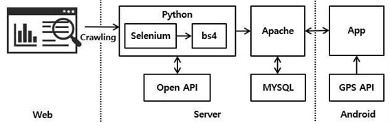
 
HTML 및 XML파일에서 데이터를 추출하기 위한 Beautifulsoup 라이브러리와 Javascript와 같은 동적 웹페이지의 데이터를 추출하기 위한 Selenium을 이용하여 기상청과 케이위더 웹페이지를 크롤링합니다. 
MySQL을 이용하여 DB에 연동하고 어플리케이션에서는 GPS API를 이용하여 해당 지역의 데이터를 제공합니다.

## 야외활동 시간대 제공 Process
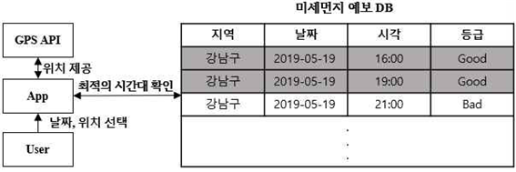
GPS API를 이용하여 사용자 위치 근방의 장소를 제공하며, 사용자가 야외 활동 장소와 날짜를 선택하면 DB의 미세먼지 데이터를 확인합니다.
미세먼지 상태가 좋음인 경우 해당 시간대를 제공합니다.

## Screenshot
### 메인화면
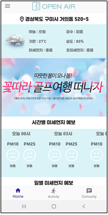 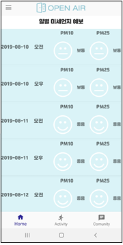 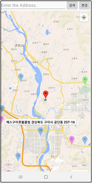
 

### 예약 및 리뷰 화면
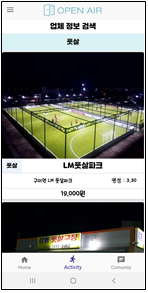 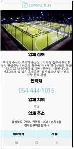 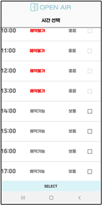 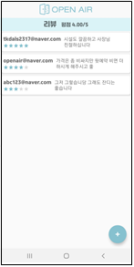
 
### 모집 및 매칭 화면
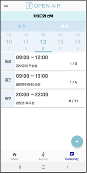 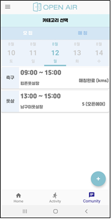 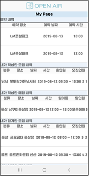
 

## Built With
* [tkdals2317](https://github.com/tkdals2317)

